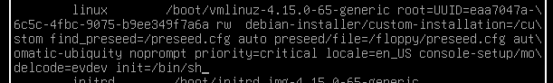

# Resetting Passwords

## If you're not logged in (and the disk isn't encrypted)
- Boot into GRUB, hit `e` to edit the GRUB config for only this boot
  - In the line that starts with 'linux' change `ro` to `rw` and add `init=/bin/sh` at the end of that line
- `Ctrl` + `x` to exit, then boot normally
- Reset your password with `passwd`
  - You might also have to run `mount -o remount,rw /` to make the filesystem writable. This command remounts `/` (root filesystem) in place

- Or, you can create a new user without a password by running `vi /etc/shadow` and adding a line like `alex::18159::::::` (username is alex, no password)
- Run `sync` to flush changes
- Reboot

[Other options](http://www.linuxandubuntu.com/home/how-to-reset-root-password-in-ubuntu)
